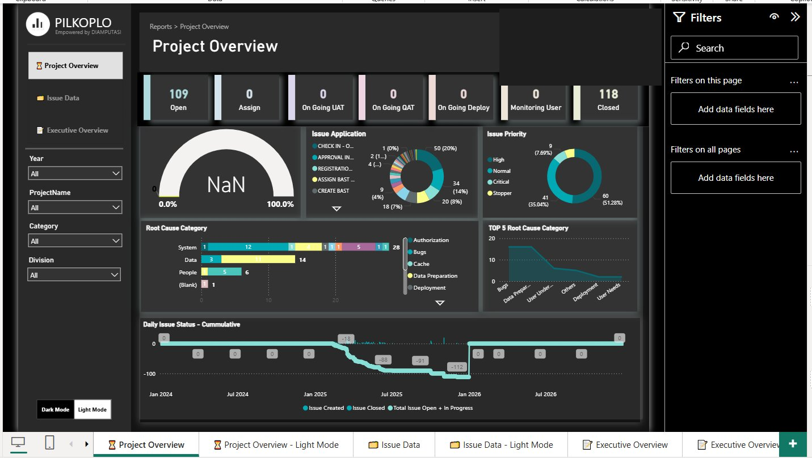

# PILKOPLO — Powerful Issue Log: Klosing Project Lo! 🚀

> An end-to-end **Microsoft 365-native Issue Tracking & BI System** built to automate post go-live project issue management — from intake to resolution, fully integrated across Microsoft Forms, Power Automate, SharePoint Lists, and Power BI.

---

## 📌 Background

After a project goes live, managing incoming issues manually through spreadsheets and email threads creates chaos — slow response times, missed assignments, and zero visibility for leadership.

**PILKOPLO** was built to solve exactly that. It transforms the entire post go-live issue lifecycle into an automated, traceable, and dashboard-ready system — entirely within the Microsoft 365 ecosystem, with zero external tools required.

---

## 🏗️ System Architecture

```
Microsoft Forms
      │
      │  (Issue submitted by user)
      ▼
Power Automate — Flow 1: OPEN
      │  ├─ Get response details & attachment URL
      │  ├─ Get user profile (Office 365)
      │  ├─ Add item to SharePoint List (per project)
      │  ├─ Add item to All Tickets master list
      │  ├─ Send email notification → PM, CO-PM, PMO Support
      │  └─ Send confirmation email → Reporter
      ▼
SharePoint Lists (Source of Truth)
      │  ├─ Per-Project Issue List
      │  └─ All Tickets Master List
      │
      │  (Status updated: Assigned / Monitoring / Closed)
      ▼
Power Automate — Flow 2: AMC (Assign–Monitor–Close)
      │  ├─ Trigger: Item created or modified
      │  ├─ Detect status change (Assign / Monitoring / Closed)
      │  ├─ Route notification to relevant roles
      │  │    ├─ Project Manager
      │  │    ├─ CO-PM (SI & IT)
      │  │    └─ PMO Support
      │  └─ Update All Tickets master list
      │
      │  (Row deleted from SharePoint)
      ▼
Power Automate — Flow 3: DELETED
      │  └─ Sync deletion to All Tickets master list
      ▼
Power BI Dashboard
      ├─ Project Overview (issue count by status, priority, root cause)
      ├─ Issue Data (drill-through per ticket)
      └─ Executive Overview (cumulative trend & summary KPIs)
```

---

## ⚙️ Tech Stack

| Layer | Technology |
|---|---|
| Issue Intake | Microsoft Forms |
| Automation | Power Automate (3 flows) |
| Data Storage | SharePoint Lists (Microsoft 365) |
| Notification | Office 365 Email (automated) |
| Reporting | Power BI (multi-page dashboard) |

---

## 🔄 Power Automate Flows

### Flow 1 — `AHM_PILKOPLO2_OPEN`
**Trigger:** When a new response is submitted (Microsoft Forms)

Handles the full intake pipeline:
- Retrieves form response details and attachment URL
- Fetches user profile from Office 365
- Creates a new item in the project-specific SharePoint List with status `Open`
- Creates a corresponding record in the All Tickets master list
- Links the two records via foreign key (`id_fk`)
- Sends an HTML-formatted email notification to PM, CO-PM, and PMO Support
- Sends a ticket confirmation email to the reporter

---

### Flow 2 — `AHM_PILKOPLO2_AMC`
**Trigger:** When an item is created or modified (SharePoint List)

Handles status transitions across the issue lifecycle:
- Detects which fields changed using `Get changes for an item (properties only)`
- Routes logic based on status: `Assigned`, `Monitoring by User`, `Closed`
- Sends targeted notifications to the appropriate roles (PM, CO-PM SI, CO-PM IT, PMO Support)
- Syncs status updates to the All Tickets master list

---

### Flow 3 — `AHM_PILKOPLO2_DELETED`
**Trigger:** When an item is deleted (SharePoint List)

Maintains master list integrity:
- Detects deleted row from project-specific list
- Finds and removes the corresponding record in the All Tickets master list via a loop

---

## 📊 Power BI Dashboard

The dashboard consumes data from SharePoint Lists and provides three reporting views:

**Project Overview**
- KPI cards: Open, Assigned, On Going UAT/QAT/Deploy, Monitoring, Closed
- Issue breakdown by Application and Priority (High / Normal / Critical / Stopper)
- Root Cause Category (stacked bar by System / Data / People)
- Daily Issue Status — Cumulative trend chart (Jan 2024 – present)

**Issue Data**
- Drill-through table of all individual tickets with full detail

**Executive Overview**
- High-level summary for leadership consumption

> Dashboard supports both **Dark Mode** and **Light Mode**.



---

## 📁 SharePoint List Schema

Key fields handled in Power Query and DAX:

| Field | Type | Notes |
|---|---|---|
| `TicketNo.` | Text | Auto-generated (PIL + sequence) |
| `Status` | Choice | Open / Assigned / On Going UAT / Closed / etc. |
| `ApplicationName` | Choice | System/app affected |
| `IssueLoggedBy` | Person | Linked to Office 365 user |
| `DateReported` | DateTime | From form submit date |
| `Phase` | Choice | Go Live Support |
| `Division` | Text | Reporter's division |
| `Attachment` | Hyperlink | URL from Forms file upload |
| `id_fk` | Number | Foreign key linking to All Tickets list |

---

## 💡 Key Design Decisions

- **Two-list architecture** — a per-project list for scoped filtering and an All Tickets master list for cross-project reporting, linked via foreign key
- **Flow separation** — Open, AMC, and Delete are separate flows for maintainability and easier debugging
- **HTML email templates** — notifications include a styled table summary generated dynamically via `Compose` + `Style_Table` actions
- **SharePoint as single source of truth** — no external database required, fully within the client's Microsoft 365 tenant

---

## 📅 Project Info

| | |
|---|---|
| **Role** | BI Engineer & Power Platform Developer |
| **Type** | Internal Innovation Project |
| **Domain** | Post Go-Live Project Management |
| **Platform** | Microsoft 365 (Forms, Power Automate, SharePoint, Power BI) |
| **Period** | 2024 – 2026 |
